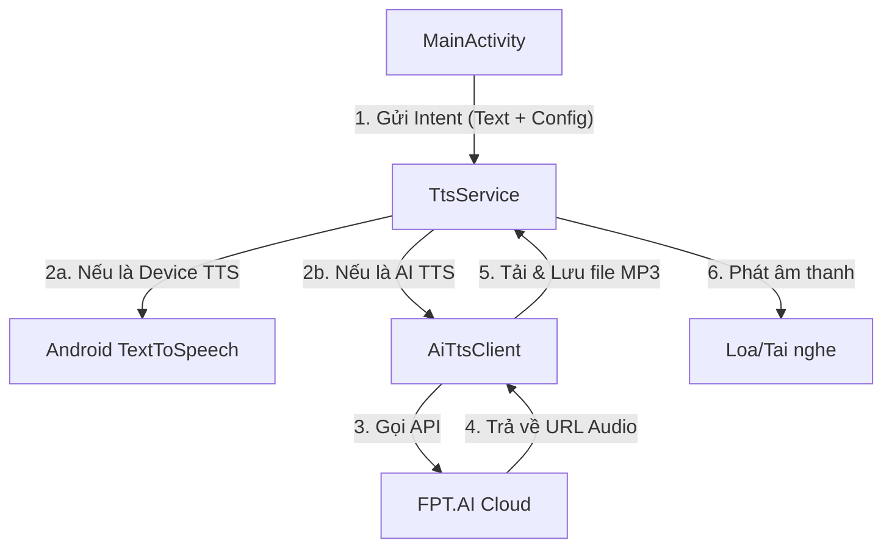

# Kiến trúc ứng dụng Read Out Loud (ROL)

Tài liệu này cung cấp cái nhìn tổng quan về cấu trúc mã nguồn và cách các thành phần trong ứng dụng ROL phối hợp với nhau.

## 🏗 Cấu trúc tổng thể

Ứng dụng được xây dựng theo mô hình **Activity-Service**. Giao diện người dùng (UI) gửi yêu cầu đọc văn bản đến một Service chạy nền (Foreground Service) để đảm bảo việc đọc không bị gián đoạn khi người dùng thoát ứng dụng hoặc tắt màn hình.

### Sơ đồ luồng dữ liệu (Data Flow)

## 🧩 Các thành phần chính

### 1. [MainActivity.kt](file:///c:/Users/Admin/Desktop/Test_code/ROL-main/app/src/main/java/com/skul9x/readoutloud/MainActivity.kt)
- **Vai trò:** Quản lý giao diện người dùng và cấu hình.
- **Chức năng:**
    - Tiếp nhận văn bản từ người dùng hoặc Clipboard.
    - Cho phép chọn loại giọng đọc (Thiết bị/AI) và mức âm lượng.
    - Lưu trữ tùy chỉnh vào `SharedPreferences`.
    - Khởi chạy và điều khiển `TtsService`.

### 2. [TtsService.kt](file:///c:/Users/Admin/Desktop/Test_code/ROL-main/app/src/main/java/com/skul9x/readoutloud/TtsService.kt)
- **Vai trò:** Thành phần cốt lõi xử lý việc đọc văn bản.
- **Chức năng:**
    - Chạy dưới dạng **Foreground Service** để tránh bị hệ thống tắt.
    - Hiển thị Notification để người dùng biết ứng dụng đang hoạt động.
    - Điều phối giữa việc sử dụng TTS mặc định của Android và AI TTS.
    - Quản lý việc phát âm thanh (MediaPlayer).

### 3. [AiTtsClient.kt](file:///c:/Users/Admin/Desktop/Test_code/ROL-main/app/src/main/java/com/skul9x/readoutloud/AiTtsClient.kt)
- **Vai trò:** Giao tiếp với API bên ngoài.
- **Chức năng:**
    - Sử dụng `OkHttp` để gửi yêu cầu đến FPT.AI.
    - Xử lý phản hồi JSON để lấy URL file âm thanh.
    - Tải file âm thanh về bộ nhớ tạm của ứng dụng.

### 4. [VoiceConfig.kt](file:///c:/Users/Admin/Desktop/Test_code/ROL-main/app/src/main/java/com/skul9x/readoutloud/VoiceConfig.kt)
- **Vai trò:** Định nghĩa dữ liệu.
- **Chức năng:**
    - Chứa danh sách các giọng đọc AI (ID, tên hiển thị, vùng miền).
    - Định nghĩa Enum `VoiceType` để phân biệt giữa giọng hệ thống và giọng AI.

## 📂 Cấu trúc thư mục quan trọng

- `app/src/main/java/com/skul9x/readoutloud/`: Chứa toàn bộ mã nguồn logic.
- `app/src/main/res/layout/`: Chứa file giao diện XML (`activity_main.xml`).
- `app/src/main/AndroidManifest.xml`: Khai báo các quyền (Internet, Foreground Service) và các thành phần của app.

## 🛠 Công nghệ then chốt

- **Kotlin Coroutines:** Xử lý các tác vụ bất đồng bộ (gọi API, tải file) mà không làm treo UI.
- **View Binding:** Truy cập các thành phần giao diện một cách an toàn và hiệu quả.
- **OkHttp:** Thư viện mạnh mẽ để thực hiện các yêu cầu HTTP.
- **Foreground Service:** Đảm bảo trải nghiệm nghe liên tục.
